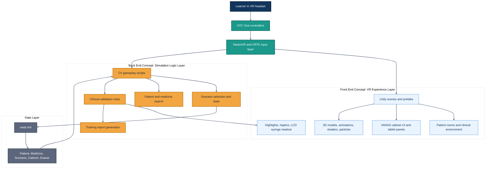
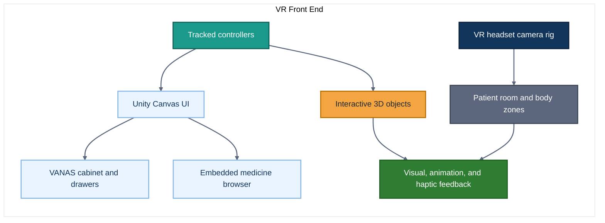
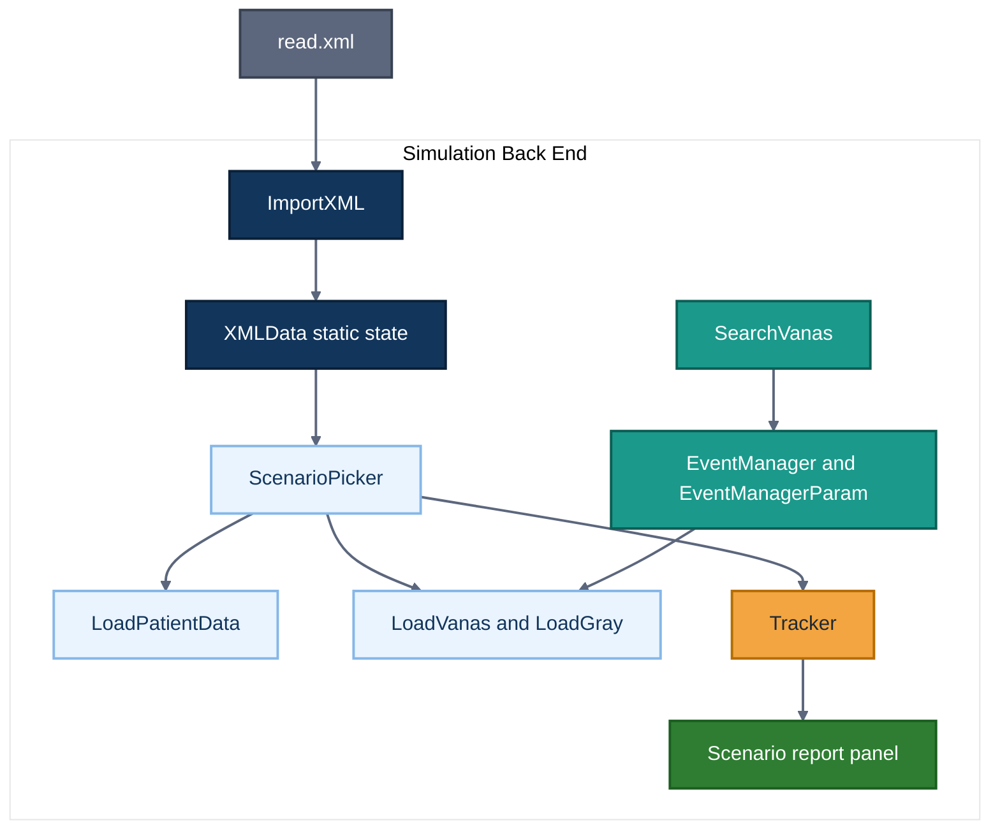
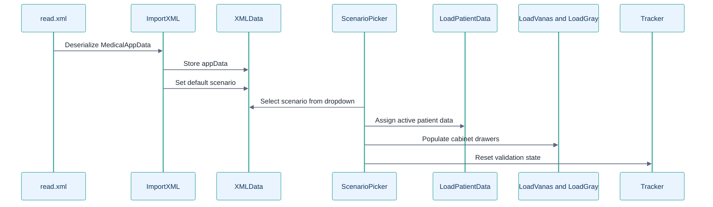
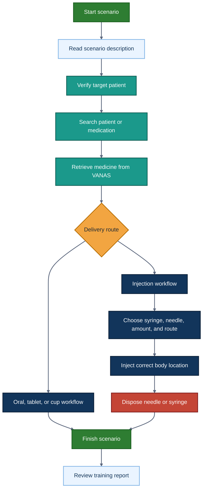
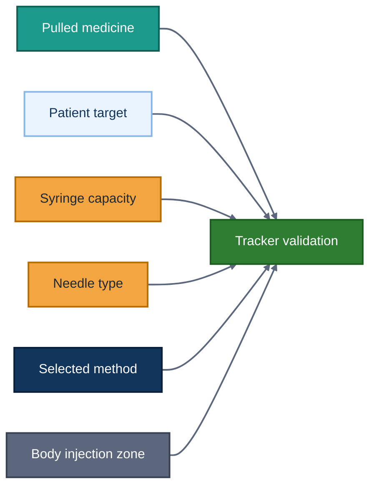
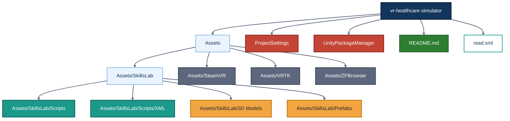

# VR Healthcare Simulator

A Unity-based virtual reality healthcare training simulator for practicing safe medication administration, patient verification, equipment selection, and clinical decision-making in an immersive nursing environment.

This repository modernizes and documents a historical Skills-Lab VR nursing simulation concept. The project is built around a simulated hospital workflow where the learner identifies the correct patient, searches a VANAS medication cabinet, retrieves the correct medication, selects the proper delivery equipment, administers the treatment, and receives feedback on clinical accuracy.

> Educational use only: this project is a learning and simulation tool. It is not medical software, does not provide clinical advice, and should not be used for real patient care decisions.

## Contents

- [Project Overview](#project-overview)
- [Training Goals](#training-goals)
- [Technology Stack](#technology-stack)
- [Color Schema](#color-schema)
- [System Architecture](#system-architecture)
- [Front-End Concepts](#front-end-concepts)
- [Back-End Concepts](#back-end-concepts)
- [Scenario Data Flow](#scenario-data-flow)
- [Medication Workflow](#medication-workflow)
- [Validation And Reporting](#validation-and-reporting)
- [Repository Structure](#repository-structure)
- [Setup Instructions](#setup-instructions)
- [Developer Guide](#developer-guide)
- [Testing Checklist](#testing-checklist)
- [Modernization Roadmap](#modernization-roadmap)
- [Attribution](#attribution)

## Project Overview

The VR Healthcare Simulator places a learner inside a clinical environment using Unity, SteamVR, VRTK, and HTC Vive style controller interactions. The learner works through scenario-based medication tasks involving patient identification, medicine lookup, storage cabinet navigation, syringe/needle selection, injection method selection, and disposal.

The current repository contains a Unity project with scenes, prefabs, 3D models, C# gameplay scripts, and XML-based scenario data. The main enabled Unity build scene is:

```text
Assets/SkillsLab/SkillsLab2.unity
```

The project currently includes:

- A simulated patient room and medication workflow.
- Patient types such as adult, child, pregnant, and senior.
- A VANAS-style medication storage cabinet.
- Searchable patient and medication UI panels.
- XML scenario loading from `read.xml`.
- Syringe, needle, oral medicine, IV hand, cup, and disposal interactions.
- Validation and reporting through the `Tracker` feedback system.
- Embedded browser support through ZFBrowser for medicine reference style screens.

Gameplay reference from the original simulator:

https://youtu.be/0RWGVET8pHc?si=vwP8ouDwiVO1itvt


## Training Goals

The simulator is designed to help healthcare and nursing students practice repeatable clinical habits in a safe virtual environment before working in real clinical settings.

Core learning objectives:

- Verify the correct patient before treatment.
- Search for the assigned patient and medication.
- Retrieve the correct medicine from the simulated VANAS cabinet.
- Select the correct delivery method for the active scenario.
- Choose the correct syringe size and needle type.
- Select the correct injection method: SC, IV, or IM.
- Administer treatment to the correct body location.
- Dispose of needles and syringes correctly.
- Receive structured feedback after completing the scenario.

## Technology Stack

| Area | Technology |
| --- | --- |
| Game engine | Unity `2017.3.0f3` |
| Language | C# |
| VR platform | HTC Vive style VR setup |
| VR SDK | SteamVR |
| Interaction toolkit | VRTK |
| Embedded browser | ZFBrowser |
| Scenario data | XML via `read.xml` |
| Main scripts | `Assets/SkillsLab/Scripts` |
| Main scene | `Assets/SkillsLab/SkillsLab2.unity` |
| Version control | Git and GitHub |

## Color Schema

The visual direction should feel clinical, calm, and safety-focused. The palette below can be used for README diagrams, future UI refreshes, report states, and training feedback screens.

| Token | Hex | Purpose |
| --- | --- | --- |
| Clinical Navy | `#12355B` | Primary headings, architecture anchors, serious system elements |
| Scrub Teal | `#1B998B` | Interactive VR actions, active selections, search and cabinet workflows |
| Sterile Blue | `#EAF4FF` | Light backgrounds, information panels, low-pressure instructional surfaces |
| Soft Slate | `#5C677D` | Secondary text, labels, neutral diagram connectors |
| Clean White | `#FFFFFF` | Main panel surfaces and readable negative space |
| Success Green | `#2E7D32` | Correct patient, correct medicine, completed safety checks |
| Alert Amber | `#F2A541` | Caution states, decisions, pending verification, scenario reminders |
| Error Red | `#C44536` | Incorrect patient, wrong medicine, failed safety checks |
| Charcoal | `#1F2933` | Primary body text and high-contrast labels |

```mermaid
%%{init: {'theme': 'base', 'themeVariables': { 'primaryColor': '#EAF4FF', 'primaryTextColor': '#1F2933', 'primaryBorderColor': '#1B998B', 'lineColor': '#5C677D', 'fontFamily': 'Arial'}}}%%
flowchart LR
    navy["Clinical Navy<br/>Primary structure"]
    teal["Scrub Teal<br/>Interactive actions"]
    blue["Sterile Blue<br/>Information surfaces"]
    green["Success Green<br/>Correct choices"]
    amber["Alert Amber<br/>Caution or pending"]
    red["Error Red<br/>Incorrect choices"]

    navy --> teal
    teal --> blue
    blue --> green
    green --> amber
    amber --> red

    class navy navyClass;
    class teal tealClass;
    class blue blueClass;
    class green greenClass;
    class amber amberClass;
    class red redClass;

    classDef navyClass fill:#12355B,color:#FFFFFF,stroke:#0B2038,stroke-width:2px;
    classDef tealClass fill:#1B998B,color:#FFFFFF,stroke:#0E5E55,stroke-width:2px;
    classDef blueClass fill:#EAF4FF,color:#12355B,stroke:#86B7E7,stroke-width:2px;
    classDef greenClass fill:#2E7D32,color:#FFFFFF,stroke:#1B5E20,stroke-width:2px;
    classDef amberClass fill:#F2A541,color:#1F2933,stroke:#B66D00,stroke-width:2px;
    classDef redClass fill:#C44536,color:#FFFFFF,stroke:#7F1D1D,stroke-width:2px;

    linkStyle 0 stroke:#1B998B,stroke-width:3px;
    linkStyle 1 stroke:#86B7E7,stroke-width:3px;
    linkStyle 2 stroke:#2E7D32,stroke-width:3px;
    linkStyle 3 stroke:#F2A541,stroke-width:3px;
    linkStyle 4 stroke:#C44536,stroke-width:3px;
```



Suggested usage:

- Use navy and charcoal for structure, titles, and highly readable documentation text.
- Use teal for active interactions such as searching, selecting, grabbing, scanning, and retrieving.
- Use green, amber, and red only for learner feedback states so safety meaning stays consistent.
- Pair color with clear text labels in all clinical feedback; do not rely on color alone.

## System Architecture

The project is a Unity application, so "front end" and "back end" are conceptual layers inside the simulator rather than separate web services. The front end is the VR experience layer the learner sees and touches. The back end is the C# simulation, scenario, validation, and data layer that drives the training logic.



## Front-End Concepts

In this Unity VR project, the front end is the learner-facing simulation layer. It includes everything that presents the hospital environment and captures user interaction.



Front-end responsibilities:

- Render the hospital room, patients, medicine cabinets, tablets, drawers, syringes, needles, and supporting 3D assets.
- Capture VR controller input through SteamVR and VRTK.
- Show search panels, scenario selection panels, medicine results, and report panels.
- Provide feedback through color changes, drawer lights, animations, haptics, and syringe LCD text.
- Support physical interactions such as grabbing, snapping, pulling, injecting, opening drawers, and moving objects.

Important front-end script areas:

- `Inventory.cs` manages the tray inventory attached to VR controllers.
- `Item.cs` handles general grabbable object behavior.
- `Drawer.cs`, `Door.cs`, and `UnlockVanas.cs` support cabinet and room interactions.
- `Tablet.cs`, `KeyBoard.cs`, and `SwitchPanels.cs` support tablet and VANAS UI behavior.
- `InjectionZone.cs`, `NaaldContainer.cs`, and `SelectInjection.cs` support injection selection and body-zone feedback.

## Back-End Concepts

In this repository, the back end is the internal Unity logic layer. It loads scenario data, stores runtime state, validates learner choices, and produces a report.



Back-end responsibilities:

- Deserialize scenario XML into C# models.
- Store the active scenario in shared runtime state.
- Populate the active patient and cabinet configuration.
- Search patients and medications from scenario data.
- Track whether the learner selected the correct patient, medication, syringe, needle, route, amount, and body location.
- Generate the final report for the scenario.

Important back-end script areas:

- `ImportXML.cs` reads `read.xml` into `MedicalAppData`.
- `XMLData.cs` stores global scenario data and helper lookups.
- `ScenarioPicker.cs` switches scenarios and resets the training state.
- `LoadPatientData.cs` assigns scenario patient data to the correct patient prefab.
- `LoadVanas.cs` and `LoadGray.cs` populate medication cabinet drawers.
- `SearchVanas.cs` searches patient and medicine records.
- `Tracker.cs` records learner actions and validates clinical choices.

## Scenario Data Flow

The simulator is data-driven through XML. The `read.xml` file defines patients, medicines, delivery tools, delivery methods, drawers, cabinets, scenarios, and metadata.



Core XML model:

```mermaid
%%{init: {'theme': 'base', 'themeVariables': { 'primaryColor': '#EAF4FF', 'primaryTextColor': '#1F2933', 'primaryBorderColor': '#1B998B', 'lineColor': '#5C677D', 'fontFamily': 'Arial'}}}%%
classDiagram
    class MedicalAppData {
        mPatients
        mMedicines
        mTools
        mMethods
        mDrawers
        mCabinets
        mScenarios
        mMetaData
    }

    class Patient {
        mID
        mName
        mAge
        mWeight
        mType
        mSex
        mAllergies
    }

    class Medicine {
        mID
        mName
        mQuantity
        mUnit
        mPackage
        mPointsOfAttention
    }

    class Scenario {
        mID
        mName
        mPatientID
        mCabinetID
        mMedicineID
        mDeliveryMethod
    }

    class Cabinet {
        mID
        mDrawers
    }

    class CabinetDrawer {
        mID
        mMedicines
        mDeliveryTools
        mIsLocked
    }

    class DeliveryMethod {
        mID
        mName
        mTools
    }

    class DeliveryTool {
        mID
        mName
    }

    MedicalAppData --> Patient
    MedicalAppData --> Medicine
    MedicalAppData --> Scenario
    MedicalAppData --> Cabinet
    MedicalAppData --> CabinetDrawer
    MedicalAppData --> DeliveryMethod
    MedicalAppData --> DeliveryTool
    Scenario --> Patient
    Scenario --> Medicine
    Scenario --> Cabinet
    Scenario --> DeliveryMethod
    Cabinet --> CabinetDrawer
    DeliveryMethod --> DeliveryTool

    classDef rootClass fill:#12355B,color:#FFFFFF,stroke:#0B2038,stroke-width:2px;
    classDef clinicalClass fill:#EAF4FF,color:#12355B,stroke:#86B7E7,stroke-width:2px;
    classDef medClass fill:#1B998B,color:#FFFFFF,stroke:#0E5E55,stroke-width:2px;
    classDef scenarioClass fill:#F2A541,color:#1F2933,stroke:#B66D00,stroke-width:2px;
    classDef storageClass fill:#5C677D,color:#FFFFFF,stroke:#374151,stroke-width:2px;
    classDef toolClass fill:#2E7D32,color:#FFFFFF,stroke:#1B5E20,stroke-width:2px;

    class MedicalAppData rootClass
    class Patient clinicalClass
    class Medicine medClass
    class Scenario scenarioClass
    class Cabinet,CabinetDrawer storageClass
    class DeliveryMethod,DeliveryTool toolClass
```

## Medication Workflow

The main training loop follows a medication administration workflow. The learner must move from scenario selection through patient verification, medicine retrieval, delivery, and disposal.



Injection-focused logic:



## Validation And Reporting

The `Tracker` class stores the active validation state for each scenario. It is reset when a scenario is selected, then updated by interactions throughout the simulation.

```mermaid
%%{init: {'theme': 'base', 'themeVariables': { 'primaryColor': '#EAF4FF', 'primaryTextColor': '#1F2933', 'primaryBorderColor': '#1B998B', 'lineColor': '#5C677D', 'secondaryColor': '#F7FBFF', 'tertiaryColor': '#FFFFFF', 'fontFamily': 'Arial'}}}%%
flowchart TB
    scenario["Active scenario"]
    targetPatient["Target patient"]
    targetMedicine["Target medicine"]
    targetTool["Target delivery tool"]
    interactions["Learner interactions"]

    subgraph checks [Tracker Checks]
        patientCheck["Correct patient"]
        medicineCheck["Correct medicine retrieved and given"]
        syringeCheck["Correct syringe size"]
        needleCheck["Correct needle type"]
        methodCheck["Correct injection method"]
        amountCheck["Correct amount applied"]
        locationCheck["Correct body location"]
    end

    report["Final report panel"]

    scenario --> targetPatient
    scenario --> targetMedicine
    scenario --> targetTool
    interactions --> patientCheck
    interactions --> medicineCheck
    interactions --> syringeCheck
    interactions --> needleCheck
    interactions --> methodCheck
    interactions --> amountCheck
    interactions --> locationCheck
    checks --> report

    class scenario actionClass;
    class targetPatient patientClass;
    class targetMedicine medClass;
    class targetTool toolClass;
    class interactions inputClass;
    class patientCheck,medicineCheck successClass;
    class syringeCheck,needleCheck,methodCheck,amountCheck,locationCheck alertClass;
    class report frontClass;

    classDef actionClass fill:#12355B,color:#FFFFFF,stroke:#0B2038,stroke-width:2px;
    classDef patientClass fill:#EAF4FF,color:#12355B,stroke:#86B7E7,stroke-width:2px;
    classDef medClass fill:#1B998B,color:#FFFFFF,stroke:#0E5E55,stroke-width:2px;
    classDef toolClass fill:#F2A541,color:#1F2933,stroke:#B66D00,stroke-width:2px;
    classDef inputClass fill:#5C677D,color:#FFFFFF,stroke:#374151,stroke-width:2px;
    classDef successClass fill:#2E7D32,color:#FFFFFF,stroke:#1B5E20,stroke-width:2px;
    classDef alertClass fill:#F2A541,color:#1F2933,stroke:#B66D00,stroke-width:2px;
    classDef frontClass fill:#EAF4FF,color:#12355B,stroke:#86B7E7,stroke-width:2px;
    linkStyle default stroke:#5C677D,stroke-width:2px;
```



Current report feedback can include:

- Whether the learner interacted with the correct patient.
- How many times the learner interacted with an incorrect patient.
- Whether the learner checked the patient in the tablet or VANAS workflow.
- Whether the correct medicine was retrieved.
- How many incorrect medicines were retrieved.
- Whether the correct medicine was given.
- Whether the correct syringe, needle, route, amount, and body location were used.

## Repository Structure



Key paths:

| Path | Purpose |
| --- | --- |
| `Assets/SkillsLab/SkillsLab2.unity` | Main enabled scene in Unity build settings |
| `Assets/SkillsLab/Scripts` | Core simulator gameplay scripts |
| `Assets/SkillsLab/Scripts/XML` | XML data models and scenario loading |
| `Assets/SkillsLab/3D Models` | Patient, room, syringe, pill, cabinet, and clinical assets |
| `Assets/SkillsLab/Prefabs` | Reusable Unity prefabs |
| `Assets/SteamVR` | SteamVR SDK files |
| `Assets/VRTK` | VR interaction toolkit files |
| `Assets/ZFBrowser` | Embedded browser package |
| `ProjectSettings` | Unity project settings |
| `read.xml` | Current scenario, patient, medication, cabinet, and delivery data |

## Setup Instructions

### 1. Clone The Repository

```bash
git clone https://github.com/djdcybersecurity/vr-healthcare-simulator.git
cd vr-healthcare-simulator
```

### 2. Install Unity

This project was created with:

```text
Unity 2017.3.0f3
```

For best compatibility, open it with Unity `2017.3.0f3` or a close Unity 2017 LTS-era editor. Opening the project in a newer Unity version may require asset upgrades, SteamVR/VRTK migration work, and scene or prefab repair.

### 3. Open The Project

1. Launch Unity Hub or the Unity editor.
2. Add this repository folder as an existing Unity project.
3. Open the project.
4. Wait for Unity to import assets and rebuild the local `Library` cache.
5. Open the main scene:

```text
Assets/SkillsLab/SkillsLab2.unity
```

### 4. Configure VR Hardware

The original target hardware is an HTC Vive style setup using SteamVR.

Recommended local checks:

- SteamVR is installed and running.
- The headset and controllers are detected.
- Unity can access the SteamVR runtime.
- VRTK controller objects are mapped correctly in the scene.

### 5. Run The Simulator

1. Open the main scene.
2. Press Play in Unity.
3. Select a scenario.
4. Complete the workflow in VR.
5. Review the report panel at the end of the scenario.

## Developer Guide

### Adding Or Editing Scenarios

Scenario content is currently defined in `read.xml`. A scenario links together:

- A patient ID.
- A cabinet ID.
- A medicine ID.
- A delivery method ID.

Basic scenario shape:

```xml
<Scenario mID="0">
  <mName>Scenario Name#Scenario description shown to the learner.</mName>
  <mPatientID>0</mPatientID>
  <mCabinetID>0</mCabinetID>
  <mMedicineID>6</mMedicineID>
  <mDeliveryMethod>3</mDeliveryMethod>
</Scenario>
```

When editing XML data, confirm that all referenced IDs exist. Invalid indexes can break scenario loading or cabinet population.

### Important Runtime Flow

1. `ImportXML` reads `read.xml`.
2. `XMLData` stores the active `MedicalAppData` and default scenario.
3. `ScenarioPicker` selects a scenario and resets tracking.
4. `LoadPatientData` assigns patient data to the correct patient object.
5. `LoadVanas` and `LoadGray` fill cabinet drawers with medication prefabs.
6. `SearchVanas`, `KeyBoard`, and `SwitchPanels` drive search and retrieval UI.
7. Interaction scripts update `Tracker`.
8. `ScenarioPicker` generates the final report.

### Current Limitations

- The project targets an older Unity version.
- SteamVR and VRTK packages are legacy dependencies.
- Scenario data is stored in XML rather than a modern content pipeline.
- Validation logic is centralized in static tracker state.
- Some scripts contain comments indicating obsolete or experimental paths.
- There is no automated Unity test suite currently documented in the repository.
- The project does not currently include a formal clinical validation process.

## Testing Checklist

Use this checklist when changing scenarios, scripts, prefabs, or clinical workflow logic.

### Scenario Loading

- The project opens without missing script errors.
- `read.xml` loads successfully.
- Scenario dropdown entries appear correctly.
- Scenario descriptions display correctly.
- The correct patient room is shown in the scenario description.

### Patient Verification

- Wristband scanning identifies the patient.
- Tablet or VANAS patient search returns expected patients.
- Correct patient interactions are tracked.
- Incorrect patient interactions increment the wrong-patient count.

### Medication Retrieval

- VANAS search returns expected medicines.
- Correct medicine retrieval updates the tracker.
- Incorrect medicine retrieval increments the wrong-medicine count.
- Cabinet drawers unlock and light correctly.
- Medicine prefabs spawn with the correct `MedicineData`.

### Injection Workflow

- Correct syringe sizes are available.
- Correct needle types are available.
- Syringe pull amount displays accurately.
- Injection route selection supports SC, IV, and IM.
- Body injection zones highlight when approached.
- Correct medicine, amount, route, needle, syringe, and location are validated.
- Needle disposal removes or disables the used needle as expected.

### Oral Or Cup Workflow

- Cup or tablet medicine can be administered to the correct patient.
- Patient animation plays correctly.
- Correct medicine and quantity are tracked.

### Reporting

- Report panel appears at scenario completion.
- Correct actions show as successful.
- Incorrect actions show as failed or counted.
- Tracker resets when loading a new scenario.

## Modernization Roadmap

Potential future improvements:

- Upgrade the project to a supported Unity LTS version.
- Replace legacy SteamVR/VRTK patterns with Unity XR Interaction Toolkit.
- Move scenario content into ScriptableObjects, JSON, or a validated authoring tool.
- Add automated tests for XML parsing, scenario validation, and scoring logic.
- Add stronger type safety around delivery tools and injection methods.
- Improve UI clarity for scenario instructions and learner feedback.
- Add screenshots, GIFs, and a short demo video.
- Add a scenario authoring guide for instructors.
- Add accessibility options for non-VR testing.
- Add structured clinical review notes for each medication scenario.
- Add CI checks for Markdown, Mermaid diagrams, and XML validity.

## Attribution

This repository is a personal learning, documentation, and modernization project based on an existing Unity VR nursing simulation concept.

Original project concept and simulator work by:

- Stefan Bauwens
- Cindy Ho

